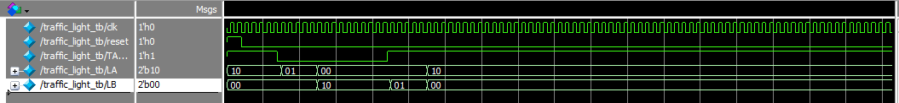

**Name:** Ahmet Koçak
**Student ID:** 2220357127

# ELE432-Advanced Digital Design  HW1: Traffic Light Controller (FSM Design)

This project implements a **Finite State Machine (FSM)** based traffic light controller using SystemVerilog. The system manages the traffic flow between two streets (Street A and Street B) based on sensor input (`TAORB`) and specific timing requirements for yellow light transitions.

## Project Files
- `traffic_light_controller.sv`: Main FSM logic and state transitions.
- `traffic_light_controller_tb.sv`: Testbench for functional verification and timing analysis.
- `traffic_light_controller.qpf/.qsf`: Intel Quartus Prime project and settings files.
- `output_waveform.png`: Simulation results from Questa/ModelSim.

## Design Specifications
- **States:** Green_A, Yellow_A, Green_B, Yellow_B.
- **Inputs:** `clk`, `reset`, `TAORB` (Traffic Sensor).
- **Outputs:** `LA` (Street A Lights), `LB` (Street B Lights).
- **Timing:** Implements a counter-based delay for yellow light transitions.

## Simulation Result
The design has been verified using **Questa Intel FPGA Edition**. The waveform below demonstrates the correct state transitions when the traffic sensor (`TAORB`) changes state.

